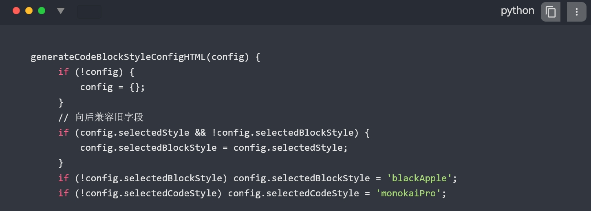
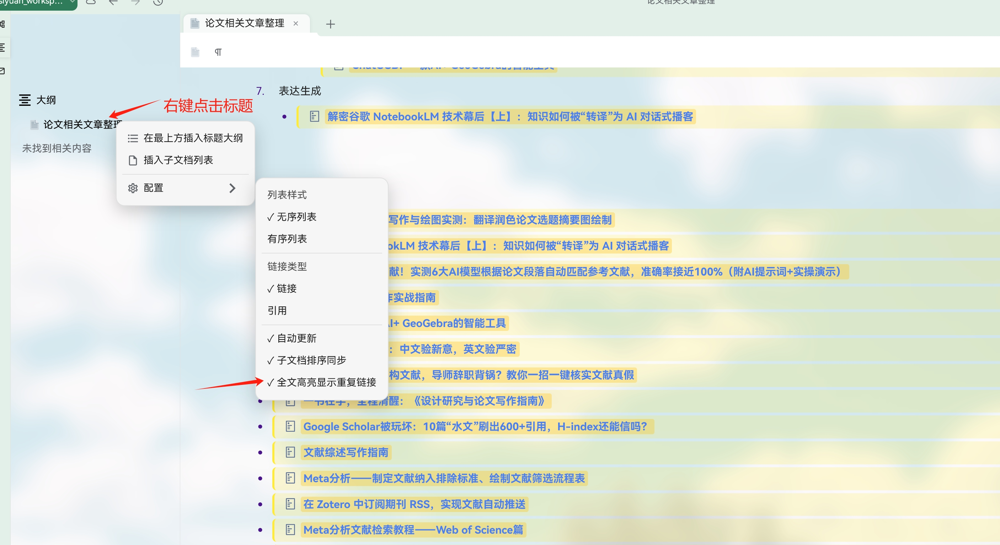
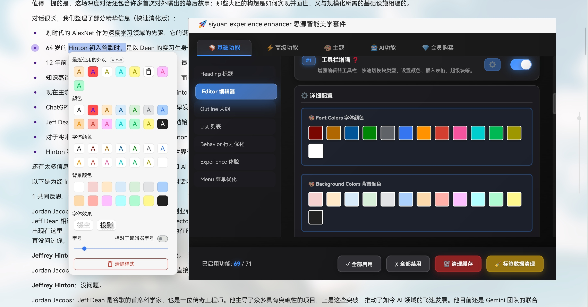
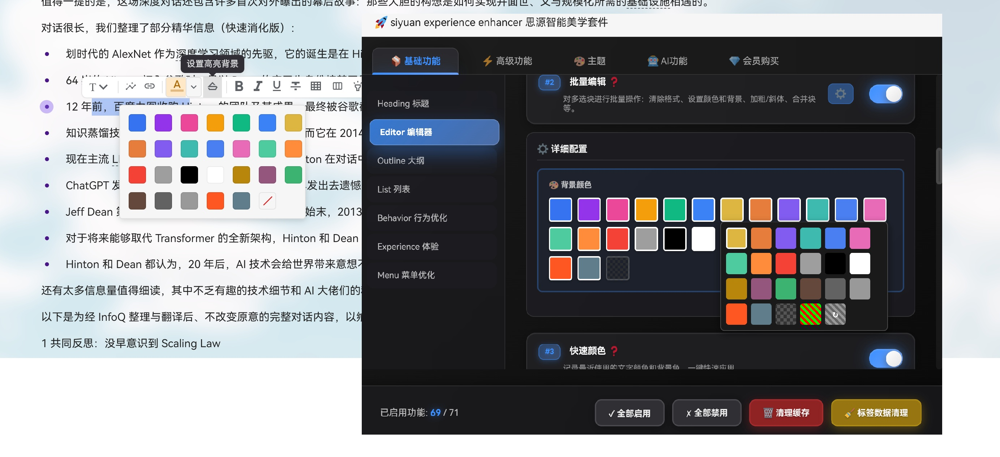

## Changelog

2025-12-26更新:

- **修复与思源版本冲突**
紧急修复了思源3.5.1版本与ai助手的冲突,在启动或者清空缓存后,如果docker的上一次状态是面板打开,会引起思源屏幕闪烁
该情况目前已修复,不算很完美解决,大家关思源前关下docker面板..不确定思源内核改了什么...

- **插件冲突修复**
  1. 修复很多用户诟病的因第三方插件冲突导致的各种潜在问题，方法是在第一次安装的时候自动关闭第三方插件，用户在获取完整体验后，后续根据自己需求在思源"设置->市集"里打开其他插件，如打开其他插件造成的功能冲突等，请自行解决,本人不会再花时间尝试兼容第三方功能。
  2. 本人不玩思源论坛和qq官方群等,善意批评我接受并努力改进插件功能,恶意吐槽诋毁,爱咋咋的,没时间搭理...
  3. 聪明人都知道这款插件的强大...谁用谁知道.呵呵..

- **代码块样式**
  2. 默认设置代码块样式为monokai pro的代码字体色

- **插入子文档列表**
  3. 新增插入子文档列表，支持高亮显示重复链接

2025-12-25 新增:

- **圣诞节快乐**
今天圣诞节,我决定把产品高级功能和AI功能延长免费使用6个月.大家可以开心的玩耍了!
然后大更一下: 主要是完成目前还没人做的编辑器颜色的自定义支持,加了对于引用块的样式自定义,以及增加文档树加载体验

- **使用期限**
  1. 产品延期免费使用6个月

- **编辑器文字/背景颜色**

  2. 文字颜色支持自定义背景颜色,文字样式+颜色
  
  3. 背景颜色支持自定义背景颜色

- **大纲**
  4 大纲增加是否粗体显示

- **文档树**
  5. 增加了初始化的时候文档树有个加载提示

- **高亮块 callout**
  6. 增加了高亮块的自定义配置

- **AI**
  7. 修复了ai提问助手面板的位置判断

2025-12-24 修复:
- **主题适配**
  1. 增加对于引用块链接的支持,在插件面板"主题"下"其他链接"里可以看到
  2. 修复了正文内间距对于片段的影响,修复了标签

2025-12-22 修复:
- **主题适配**
  1. 初次载入后默认载入亮色主题

2025-12-21 修复:

- **AI助手**: 修复正确使用全局代理直接在思源里访问 ChatGPT、Gemini 等国外AI网站
  如何使用查看教程: https://zhongcaodaren.feishu.cn/docx/TcaXddhNbozq3JxZF2gc5LEQnJc

2025-12-20 优化项目:

- **皮肤样式**
  1. 对黑苹果风格皮肤对菜单背景和字体颜色的支持支持
  2. 增加对于标签和书签的背景跟随默认设置(不在透明显示)
  3. 增加支持关闭皮肤默认样式

- **大纲样式**
  4. 增加大纲行的完整显示(默认勾选)
  5. 对大纲面板增加"仅应用样式(不采用飞书布局)的选项

- **搜索**
  6. 关闭插件,ctr+F再次打开搜索框需要点多次才关闭

- **快捷键**
  7 自定义快捷键被覆盖的问题

- **背景**
  8. 载入后没有自动载入到背景

# 思源 AI · 美学 · 体验套件

让思源同时好用、好看、又聪明：在真实工作流里打磨交互体验，提供完全可定制的主题与艺术化配色，并把 AI 深度嵌入产品细节。几乎重写了思源的日常交互与视觉体验，从工具栏、菜单、标题,折叠逻辑到搜索、导航、聚焦模式,粘贴、标签、书签,引用,历史还原、AI 助手等等全面换代。

中间借鉴了不少人的想法,特别感谢 Achuan-2 Tsundoku 主题提供的 148 种图标以及 "写味"主题提供的sugar配色

所以我承诺基础功能永久免费开放给大家使用!

插件详细功能介绍:https://zhongcaodaren.feishu.cn/docx/TcaXddhNbozq3JxZF2gc5LEQnJc?from=from_copylink

## 核心理念

- 体验：减少摩擦，让编辑、浏览、搜索、导航流畅顺手
- 美学：全局主题、字体、纹理、渐变与氛围配色，兼顾纯净与风格化
- 智能：原生融入的 AI 助手与自动化,对内容做了特别的语义处理

## 体验升级

- 重写了标签,书签,搜索,历史还原,备注等的交互逻辑和展现
- 重新了标题,列表,编辑器等的交互逻辑
- 近70+功能,上百项细节处配置让用户真正获得丝滑体验

## 美学与主题

- 全局主题/字体/行距/圆角/阴影等可调
- 内置艺术化配色与纹理，可一键切换或作为模板自定义
- 支持纯色、渐变、插画质感背景，兼顾阅读与演示

## 智能能力

- ChatGPT/Gemini 等数十个AI网站原生交互界面：支持全局,部分引用,直接在原文备注
- 自动化：粘贴依从模式、链接标题自动拉取、网络图片本地化
- 搜索与组织：自动化打标签、内容经过深度理解,聚合标题/编号，快速批量移动或引用

## 常见问题

- 启用/关闭某个能力：在插件设置的「功能开关」里独立控制
- 性能影响：默认按需加载，并提供自动折叠与缓存策略；遇到超大文档可适当关闭实时特性

## 参与 & 反馈

- Issue & PR 欢迎：请保持功能可开关、遵循现有风格并补充必要文档
- 联系：作者 少侠 / 微信 572378589

如果这个套件让你的思源更顺手、更好看或更聪明，请购买会员支持
